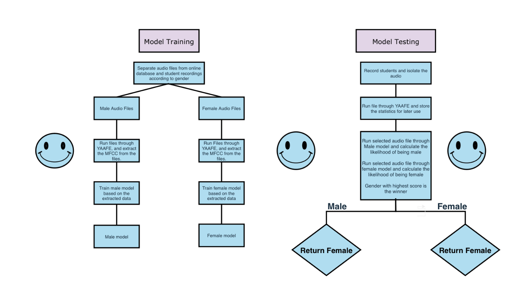

hi guys, this is all licensed under the mit license, i don't know what that is but all the cool hacker people are doing it, so im gonna do it too

if u want to use this, here are the steps!

first clone the repository...

#### if ur from my science fair thing, this isn't updated i havn't incorperated the gui into this yet, 2 lazy anyway...
#### if ur from my feds.lol/eskol page get outa here lurking bum

    git clone https://github.com/Lgao978/Gender-deciding-thingy
    
open cmd as admin, and change the directory to the right one

    cd Gender-deciding-thingy (usually this, if not just put the right one) 

and then install the requirements...

    pip install -r requirements.txt

and run Run.py...

    python run.py!

# this is the cool thingy i see in a lot of projects

  

    

the rest of this readme is gonna be random images

# im nothin like yall

  

  

